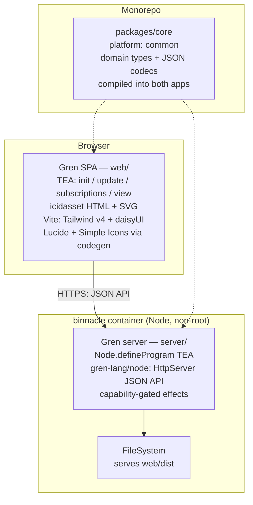

# ADR-0001: Gren full-stack base for binnacle

> **Superseded by ADR-0004** (2026-08-18): binnacle's base stack is now Elixir + Phoenix + LiveView, still all functional programming. This ADR is kept for the record; the design-system reasoning it carried over is alive in ADR-0004.
>
> **Disambiguation (2026-08-21).** The superseded-by edge above means ADR-0004, the **Elixir full-stack base**, and nothing else. A second file briefly also claimed the number 0004 — the OIDC ADR, which extended *this* one and has been renumbered to ADR-0006 and repointed at ADR-0004. ADR-0001 is superseded, not extended, and no edge from it survives to the OIDC work.

## Context and Problem Statement

binnacle is a bespoke StumpCloud web application for monitoring and controlling hosts across the fleet. We want a statically-typed functional language for the UI, and we do not want a second language bolted on just to serve it: one language end-to-end means the wire contract (types, JSON encoders/decoders) is defined once and compiled into both the browser app and the server. Gren (https://gren-lang.org/) is such a language — a functional language in the Elm lineage that compiles to the same browser JS *and* to Node.js, with a first-party server package (`gren-lang/node`: HTTP server, WebSocket server, child processes, filesystem, SQLite). What base stack — language, project structure, and supporting frontend assets — do we build binnacle on?

## Decision Drivers

* One language end-to-end: define the wire contract once and compile it into both the server and the browser app.
* The stack should lean into Gren's functional-programming model — The Elm Architecture (TEA), pure cores, effects represented in the type system — not fight it.
* Hard frontend requirements: a CSS framework, general-purpose UI icons, and Simple Icons (https://simpleicons.org) for service/brand logos.
* Delivery is a single Docker container, small, running as non-root.
* Uniform `make test` / `make lint` / `make check` entry points wired into CI.
* The fleet's services are predominantly Go — but binnacle is a bespoke application, not a library others consume, so fleet symmetry is a preference, not a constraint.

## Considered Options

* Gren full-stack: one Gren monorepo — browser app + Node server + shared core package
* Elm SPA + Go backend (the superseded plan this repo originally carried)
* Elm SPA + Gren backend (Elm's mature frontend ecosystem on top of Gren's Node server)
* TypeScript full-stack (Node on both ends)

## Decision Outcome

Chosen option: "Gren full-stack", because it collapses the stack to one language, lets the wire contract live in a single shared package compiled into both apps, and everything a server needs — HTTP, WebSockets, child processes, filesystem — is first-party in `gren-lang/node`. The frontend asset gaps (CSS framework, icons) are real but bridgeable with standard npm tooling and a small repo-owned code generator.

### Consequences

* Good, because the wire contract is written once: a `packages/core` Gren package (types + codecs) is compiled into both the server and the browser app via `local:` path dependencies (compiler-supported; the pattern gren-lang's own repos use).
* Good, because both ends of the wire are statically typed with the same types — no duplicated contract in two languages to keep in sync.
* Good, because side-effecting subsystems (HTTP server, child processes, filesystem) use Gren's capability model: each must be initialized in `init` and every call carries its `Permission` value, so the server's blast radius is auditable from one place.
* Good, because CI gets simpler, not harder: Node was already unavoidable for the frontend toolchain; there is no second backend toolchain to maintain.
* Bad, because Gren is pre-1.0 (compiler 0.6.6) with breaking releases roughly twice a year. Mitigations: `gren-version` is pinned exactly in `gren.json` (mismatched compilers refuse to compile) and resolved dependencies are committed as `gren_packages/` for zero-install builds.
* Bad, because the ecosystem is ~45 packages: no icon packages, no typed-CSS codegen, no review/lint tool, and the formatter is still in development. We own the icon codegen and accept plain-string CSS classes.
* Bad, because the container is a Node runtime instead of a distroless static binary — a larger image than a compiled-language equivalent.
* Bad, because binnacle becomes the non-Go service in a Go fleet; the Gren maintainability pool is effectively us and the agents.

## How We Structure the Project

A Gren monorepo of three projects plus tooling:

```
binnacle/
  server/            # Gren application, "platform": "node"
  web/               # Gren application, "platform": "browser" (Vite project)
  packages/core/     # Gren package, "platform": "common" — types + JSON codecs
  tools/icons/       # icon codegen (Node scripts, pinned npm inputs)
  docs/adrs/
  Dockerfile
  Makefile
  gren_packages/     # committed — zero-install, offline builds
```

* **`packages/core`** is the single source of truth for the wire contract and all domain types. The two apps depend on it as `"binnacle/core": "local:../packages/core"` (local path dependencies are application-only; fine, since only our apps consume it). Its `gren.json` is `type: package` / `platform: common`, so the compiler guarantees it compiles for both browser and Node.
* **`server/`** is `type: application` / `platform: node`. Its `gren.json` pins an exact `gren-version`; deps are concrete versions, not ranges. It serves the built SPA from disk via `FileSystem` (there is no asset-embedding story; hashed static files ship as files in the image).
* **`web/`** is `type: application` / `platform: browser`, built through Vite (see Frontend assets below) into `web/dist`.
* **`gren_packages/`** is committed. Since Gren 25S, resolved dependencies vendor as `.pkg.gz` bundles in this folder specifically so projects compile without network access — CI and every fresh clone benefit.
* Upgrades of the compiler are deliberate acts: bump the pinned `gren-version`, let the compiler refuse mismatched builds, diff the result.

## How We Leverage Functional Programming

The point of choosing Gren over a multi-language stack is to actually live in its model, on both ends:

* **TEA everywhere.** The browser app is standard The Elm Architecture (`init` / `update` / `subscriptions` / `view`). The server is the same shape via `Node.defineProgram`: HTTP requests arrive as subscriptions, responses and other effects go out as commands from `update`. One mental model, both runtimes.
* **Pure core, effects at the edges.** `update`, `view`, and all domain logic are pure functions of `Model` and `Msg`. Effects never happen inside logic — they are `Cmd msg` values the runtime performs. This is what keeps the core unit-testable without mocks: a test constructs a `Model`, sends a `Msg`, asserts on the returned `Model` and commands.
* **Make impossible states unrepresentable.** Domain concepts are custom types with variants, not stringly-typed flags or booleans; state machines exhaustively `case` on them so adding a variant is a compile error everywhere it must be handled.
* **Errors as values.** `Result` for fallible operations, no exceptions to catch. The type signature is the contract; the compiler enforces that callers handle failure.
* **Async as `Task`.** Composition of ordered async work is `Task` chaining (`Task.andThen` / `Task.onError`), testable and cancellable, with no promise-tower indirection.
* **Capabilities thread from `init`.** `Init.await` initializes each effectful subsystem and yields its `Permission`; functions requiring effects take that permission explicitly. Nothing deep in the codebase can quietly open a socket or spawn a process — the set of capabilities is declared once, up front, and visible in `init`.

## Frontend Assets (CSS, icons)

These ride on the chosen option and are part of this decision:

* **HTML/SVG layer**: `icidasset/html-virtualdom-gren` + `icidasset/svg-gren` — the ecosystem consolidated on these as the browser HTML/SVG packages.
* **CSS framework: Tailwind CSS v4 + daisyUI**, delivered through Vite with the official `gren-lang/vite-plugin-gren` (recompiles and refreshes on save; no true HMR). Classes are written as plain strings (`class "btn btn-primary"`) — no typed-CSS codegen exists for Gren, so class typos are not compiler-checked. That cost is accepted.
* **UI icons: Lucide** (https://lucide.dev). No Gren package exists; icons are SVG like any other, so a repo-owned generator script produces Gren modules from the `lucide` npm package's data into `svg-gren` calls. Start with a hand-curated allowlist; the generator makes the full set cheap later.
* **Service icons: Simple Icons** (https://simpleicons.org) via the `simple-icons` npm package and the same repo-owned codegen.

## Tooling and Commands

* **Tests**: `gren-lang/test` (the official test framework: `Test.describe` / `Test.fuzz`, `Expect` assertions) run through `gren-lang/test-runner-node` — the runner is a Gren program compiled and executed per project, so `make test` wraps that, not an external CLI.
* **Formatter / lint**: none exists today (`gren format` is in development; no review tool). `make lint` wraps gitleaks and whatever arrives later.
* **Build**: `gren make` for the server (Node JS output), `vite build` for the web app; both behind `make` targets.
* CI invokes the same `make` targets so local green and CI green cannot drift.

## Confirmation

* `make check` is green: `packages/core` and `server` test suites pass; `web` builds via Vite; gitleaks clean; compiler version pinned.
* `make icons` regenerates the Lucide and Simple Icons Gren modules deterministically from pinned npm versions; referencing an unknown icon fails the build.
* `make docker` produces an image that serves the SPA at `/`, answers `/healthz`, and runs as a non-root user.

## Pros and Cons of the Options

### Gren full-stack (chosen)

One monorepo, three Gren projects sharing `packages/core`.

* Good, because one language, one registry, one breaking-change calendar — and a shared typed core that both apps compile against.
* Good, because the entire server surface needed is first-party in `gren-lang/node`: `HttpServer`, `WebSocketServer`, `ChildProcess`, `FileSystem`, `Sqlite`, `HttpClient` — no third-party server framework bet.
* Good, because the capability/permission model makes the app's effects explicit and auditable.
* Good, because breaking-release risk is contained: exact `gren-version` pinning plus committed `gren_packages/` make upgrades a deliberate, diffable act.
* Neutral, because the browser HTML stack is community packages (`icidasset/*`) rather than core — the ecosystem consolidated there.
* Bad, because tooling is thin: compile-it-yourself test running, no formatter yet, no review tool, tiny ecosystem.
* Bad, because adoption is niche; answers will come from the book and the source, not from a decade of blog posts.

### Elm SPA + Go backend (rejected)

The plan this repo originally carried: an Elm SPA served by a Go `net/http` server that embeds the bundle, one static binary, distroless image.

* Good, because the frontend ecosystem is mature (icon packages, typed-Tailwind codegen, established test/review/format tooling).
* Good, because a static Go binary yields the smallest, most boring container, and Go matches the rest of the fleet.
* Bad, because it is two languages and two CI toolchains by construction, and the wire contract is maintained twice with no codegen bridge.
* Bad, because Gren now compiles to both targets, so the second language buys nothing this stack does not provide.

### Elm SPA + Gren backend (rejected)

The pragmatic in-between: keep Elm's mature frontend ecosystem, run the server on Gren's Node platform.

* Good, because the frontend asset gaps close for free: typed-Tailwind codegen, icon packages, and elm-format / elm-review / elm-test all exist in Elm-land.
* Good, because the frontend escapes Gren's breaking-release cadence — Elm 0.19.1 has been stable since 2019.
* Bad, because it forfeits the primary decision driver: Gren and Elm are separate languages with separate compilers, standard libraries, and package registries. `packages/core` cannot compile in both, so the wire contract is written twice — and no codegen bridge between the languages exists; building one would be another tool we own. Two structurally similar but incompatible copies drift more dangerously than Elm-vs-Go ever would, because the similarity invites copy-paste between them.
* Bad, because it stacks the costs of both rejected options while recovering neither benefit: two languages, registries, and CI toolchains (the Elm+Go rejection) plus the Node container and pre-1.0 backend risk (accepted only because full-Gren buys the shared core) — and still no static binary.
* Bad, because Elm's stability is also stasis: the frozen compiler and stdlib are why Gren forked in the first place, and the hybrid re-opts into that governance for half the stack.

Not chosen, but noted as the escape hatch: if frontend tooling costs exceed estimates — the icon codegen balloons, or the missing formatter/review tooling becomes chronic — Elm-frontend-plus-Gren-backend is the fallback that recovers them, at the price of the shared core.

### TypeScript full-stack (rejected)

Node on both ends, one mainstream language and the industry-default tooling.

* Good, because the ecosystem is the largest on earth: every CSS framework, icon set, and test runner has first-class support.
* Good, because hiring and AI-assisted maintenance draw on the widest possible pool.
* Neutral, because gradual typing approximates compile-time guarantees but does not match them; discipline substitutes for what the compiler does not enforce.
* Bad, because effects are unconstrained — any function can await, fetch, or throw — so purity and error handling are conventions, not guarantees.
* Bad, because it abandons the functional-guarantees goal this project set out with.

## Architecture Diagram



Build pipeline: `node` stage runs the icon codegen and `vite build` (producing `web/dist`), compiles the Gren server, and assembles `gren_packages` → runtime stage is `node:<lts>-alpine`, non-root, serving `web/dist` via `FileSystem`.

## More Information

* Gren: https://gren-lang.org/ · book (gren.json appendix, Node applications, ports): https://gren-lang.org/book/ · `gren-lang/node` docs: https://packages.gren-lang.org/package/gren-lang/node/version/latest/overview · package registry: https://packages.gren-lang.org/ · official Vite plugin: https://github.com/gren-lang/vite-plugin-gren · test framework: https://github.com/gren-lang/test + https://github.com/gren-lang/test-runner-node.
* Frontend assets: https://tailwindcss.com · https://daisyui.com · https://lucide.dev · https://simpleicons.org · the icon-codegen pattern is ported from https://github.com/agj/elm-simple-icons.
* Expected follow-up ADRs: authentication/exposure model; live-update channel and message schema; host-probe/agent design; icon-codegen tool spec.
