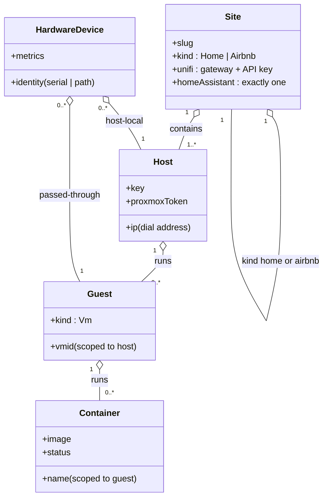
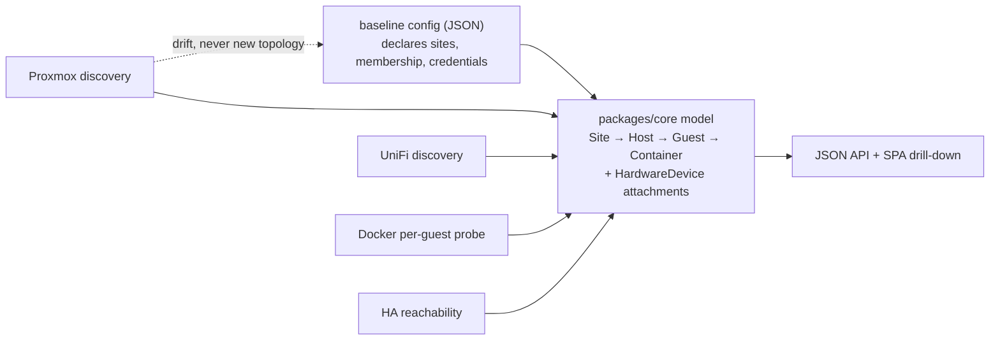

# ADR-0002: StumpCloud fleet taxonomy — Site → Host → Guest → Container with hardware attachments

## Context and Problem Statement

binnacle monitors and controls StumpCloud, whose physical layout is uniform: each site (a home or an Airbnb, identified by a normalized site name) has a UniFi gateway and exactly one Home Assistant; one or more physical hosts per site run Proxmox; Ubuntu VMs run inside Proxmox and host services as Docker containers fronted by Caddy; physical devices (drives, NICs, GPUs, sensors) are sometimes passed through to a VM and sometimes kept at the host. Hosts never span sites. What entity model do we standardize on so that discovery, navigation, and hardware attribution all agree — and that lands in the shared Gren core package from ADR-0001?

## Decision Drivers

* The primary UI navigation is a strict drill-down: sites → hosts → VMs → containers.
* Passthrough means a physical device's home is either the host or one specific VM; metrics must be attributed where the device actually lives, at either level.
* Integrations are naturally scoped: UniFi gateway + API key per site; Proxmox admin API per host, many hosts to one site; one Home Assistant per site.
* Normalized site names are the existing join key across StumpCloud (Caddy site labels, DNS, naming conventions) — the taxonomy must adopt them, not invent a parallel naming scheme.
* The model must be expressible as Gren custom types + JSON codecs in `packages/core` (ADR-0001), with invariants the compiler can check.
* Discovery should be as broad as possible, but membership (what exists, where) must stay a deliberate, config-declared act.

## Considered Options

* Fixed containment spine (Site → Host → Guest → Container) with hardware attached to exactly one Host or Guest
* Flat tag-based inventory (label every entity; derive the hierarchy at query time)
* General graph model (arbitrary nesting / DAG between entities)

## Decision Outcome

Chosen option: "Fixed containment spine with hardware attachments", because the fleet is genuinely tree-shaped (hosts never span sites, guests never span hosts), the UI's drill-down becomes the model itself rather than a view reconstructed from labels, and passthrough is modeled exactly by letting a hardware device attach to precisely one node — either a Host or a Guest.

### Consequences

* Good, because the hierarchy is structural and compiler-checked: parent references are non-nullable, every entity except Site has exactly one parent, and "where does this live" can never be ambiguous or derived-wrong.
* Good, because hardware attribution matches physical reality: a passed-through drive reports under its guest, a host-local sensor under the host, and the type system forces every device to have exactly one owner node.
* Good, because Site maps 1:1 onto integration credentials (one UniFi key, N Proxmox tokens, one Home Assistant endpoint per site), so credential scoping and blast radius follow the taxonomy.
* Good, because identity is stable and derivable without a registry of synthetic IDs: site slug (config), host key (config), vmid@host, container-name@guest, device-identity@owner.
* Bad, because the spine is rigid: an entity that is not exactly a site, host, guest, or container has no place. Mitigation: the third level is "Guest", not "VM" — a Proxmox LXC container fits as a Guest variant if it appears; anything genuinely new gets a follow-up ADR rather than a quiet hack.
* Bad, because ownership changes (re-passthrough, guest migration between nodes) re-parent entities, and v1 keeps no ownership history — only current state.

## The Model

| Entity | Identity | Declared by (config) | Enriched by (discovery) |
|---|---|---|---|
| Site | normalized slug | kind (`home` / `airbnb`), UniFi gateway + API key, exactly one Home Assistant | UniFi device inventory, HA presence |
| Host | config key; dial address is its IP | site membership (exactly one) | Proxmox node status, host-local hardware, metrics |
| Guest | vmid scoped to its host | — | name/status, passthrough hardware, metrics; variant `vm` (LXC later) |
| Container | Docker container name scoped to its guest | — | image, status; fronted by Caddy |
| HardwareDevice | device identity (serial / stable path) scoped to its owner | — | attachment (Host or Guest, from Proxmox config), usage / consumption / capacity / temperature metrics |

## Authority: config declares, discovery describes

* The baseline config file (JSON) is authoritative for existence and membership: which sites exist and their kinds, host→site mapping with dial IPs and Proxmox tokens, UniFi keys, the single Home Assistant per site.
* Discovery (Proxmox, UniFi, Docker, HA reachability) is authoritative for live state beneath configured entities: inventory details, hardware attachment, metrics.
* Discovery MUST NOT create Sites or Hosts. Anything observed outside configured topology is surfaced as config drift, never as a new entity.

## Integration Mapping

| Source | Scope | Provides |
|---|---|---|
| UniFi API | per site | gateway presence + health, network-device inventory |
| Proxmox API | per host | node + guest inventory, storage/disks, sensors where exposed, passthrough map, usage/consumption/capacity/temperature metrics |
| Docker (per guest) | per guest | container inventory — via a per-guest companion probe (host-probe/agent design anticipated by ADR-0001) |
| Home Assistant | per site | presence/health only (deep telemetry out of scope) |
| Caddy | per site | service fronting (later; normalized site names are the join key) |

## Pros and Cons of the Options

### Fixed containment spine with hardware attachments (chosen)

* Good, because the model is the navigation: no grouping logic to write, test, or get subtly wrong in one of three consumers (discovery writer, API, UI).
* Good, because the invariants we care about (single parent, hosts never span sites, hardware has one owner) are type-level, not runtime conventions.
* Good, because site-scoped credentials make the audit surface in `init` (ADR-0001 capability model) read like the org chart.
* Bad, because it is rigid for non-tree realities — none are known today, and the rigidity is the point.
* Bad, because hardware identity stability depends on what Proxmox exposes (serial when available, path otherwise) — device identity may need per-vendor care.

### Flat tag-based inventory

Every entity carries labels (`site=cottage`, `level=guest`, `host=pve1`); the hierarchy is derived at query time.

* Good, because adding a dimension costs a label, not a migration; maximal flexibility.
* Bad, because the one hierarchy we guarantee to users becomes an emergent re-derivation — every consumer re-implements grouping and can disagree.
* Bad, because nothing stops a container tagged with a nonexistent site or a host tagged into two sites; exactly the invariants we want compiler-checked become runtime conventions.
* Bad, because passthrough (device owned by host *or* guest) has no natural expression — it becomes two competing labels.

### General graph model

Entities are nodes; edges are typed and arbitrary (clusters, multi-homed services).

* Good, because it handles any future shape without migration.
* Bad, because the fleet is not that shape: the generality buys cycle-prevention and reachability machinery instead of the one drill-down we actually render.
* Bad, because bespoke single-operator tooling should optimize for legibility, not possibility space.

## Architecture Diagram

Authority flow:

## Confirmation

* `packages/core` compiles the taxonomy as custom types with JSON codecs; a malformed parent reference is a decode-time error, never a silent orphan.
* Discovery integration tests verify the authority boundary: entities observed outside config surface as drift (scenarios in SPEC-0001).
* The SPA renders the four-level drill-down with hardware panels at both host and guest level.

## More Information

* Realized by SPEC-0001 (`docs/specs/fleet-taxonomy/`).
* Extends ADR-0001 — the taxonomy types live in its shared `packages/core`.
* Expected follow-ups: host-probe/agent design (the container-discovery channel), authentication/exposure model, live-update channel and message schema.
