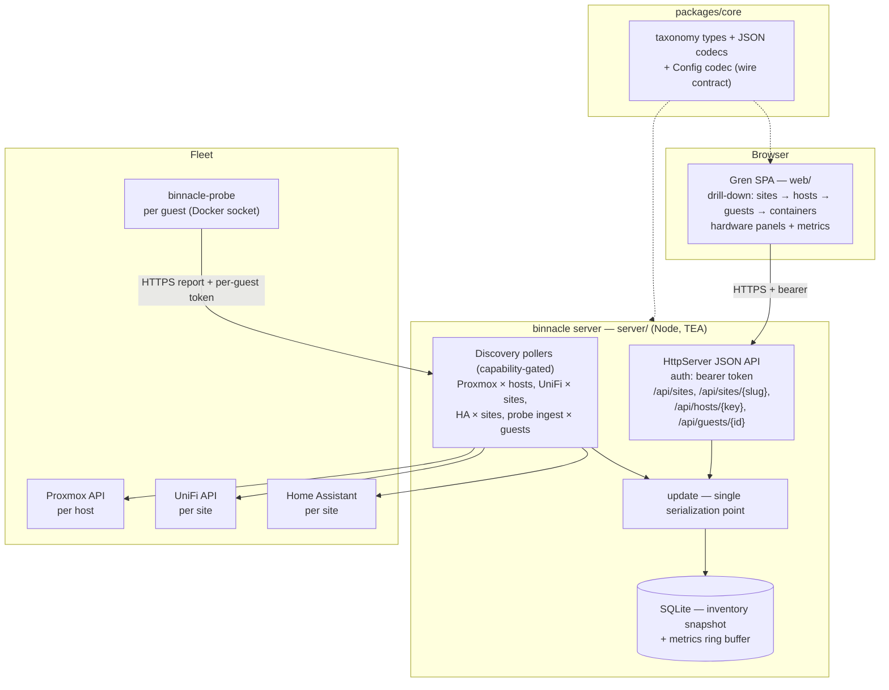

# Design: Fleet Taxonomy — Model, Baseline Config, and Discovery

## Context

binnacle is a greenfield Gren full-stack application (ADR-0001): a Node server, a browser SPA, and a shared `packages/core` holding the wire contract. This spec (SPEC-0001) implements ADR-0002's taxonomy — Site → Host → Guest → Container with hardware attachments — as binnacle's first capability. The fleet it models: per site (home or Airbnb, normalized name) one UniFi gateway, one Home Assistant, and one or more Proxmox hosts; Ubuntu VMs on Proxmox running Docker containers fronted by Caddy; hardware sometimes passed through to a VM.

## Goals / Non-Goals

### Goals

- Express the full taxonomy as Gren custom types + JSON codecs in `packages/core`, shared by server and SPA
- A hand-editable baseline JSON config that declares topology and credentials, validated at startup
- Maximum practical discovery breadth: Proxmox (inventory, hardware, sensors, metrics, passthrough), UniFi (gateway + network devices), Docker containers per guest, HA presence
- A drill-down UI (sites → hosts → guests → containers) with hardware panels and metrics at host and guest level
- Degradation that is visible, not silent — unreachable sources keep last-known state, marked stale

### Non-Goals

- Control actions (start/stop guests or containers) — binnacle grows these later on this model
- Historical metrics / time-series storage — v1 keeps current snapshot plus a short ring buffer
- Deep Home Assistant telemetry — presence and version only
- Alerting and notifications
- The authentication/exposure model beyond the single-operator bearer token (follow-up ADR)
- Live push updates (WebSocket channel — follow-up ADR; v1 polls and refreshes)

## Decisions

### Config file format: JSON

**Choice**: The baseline config is a single JSON file (`binnacle.json`), decoded by a `Config` codec in `packages/core`.

**Rationale**: Gren has first-party JSON codecs and no ecosystem YAML/TOML parser (~45 packages total). Using JSON means the config validates through the same decoder machinery as the wire contract, produces the same quality of actionable decode errors, and adds zero dependencies. Hand-editing comfort is preserved by keeping the file small and by shipping a `make config-check` target that fails fast with precise errors.

**Alternatives considered**:
- YAML: better hand-editing ergonomics, but requires owning a parser or a build-time conversion step — permanent tooling surface for one file
- TOML: same missing-parser problem as YAML

### Authority split: config declares, discovery describes

**Choice**: Sites, site kinds, host→site membership, and all integration credentials exist only in config. Discovery writes live state beneath configured entities and never creates or re-scopes topology; observations outside config surface as drift entries.

**Rationale**: Membership is a small, deliberate, human-owned set (a handful of sites and hosts); live state is large and machine-owned. Keeping the boundary explicit makes "why is pve9 not showing up" answerable in one place (the config) and prevents a mis-scoped API key from silently inventing topology.

**Alternatives considered**:
- Discovery-authoritative (auto-create sites from UniFi names): rejected — drift between UniFi naming and normalized site names would fork the taxonomy
- Full auto-discovery with manual approval queue: rejected — overkill for a single-operator fleet

### Identity derivation (no synthetic ID registry)

**Choice**: Site = config slug; Host = config key; Guest = `vmid@hostKey`; Container = `containerName@guestId`; HardwareDevice = device identity (serial when Proxmox exposes it, stable path otherwise) scoped to owner.

**Rationale**: Every identity is derivable from data we already have, survives restarts without an ID table, and composes into the API's path segments (`/api/hosts/pve1`, `/api/guests/101@pve1`). Synthetic IDs would add a mapping to keep consistent and leak into URLs meaninglessly.

**Alternatives considered**:
- UUID-per-entity with a registry table: rejected — nothing needs anonymized identity, and derivable IDs make debugging direct.

### Container discovery channel: per-guest companion probe

**Choice**: A tiny companion container ("binnacle-probe") deploys on each Docker guest, reads the local Docker socket, and reports container inventory to the server over HTTPS using a per-guest token declared in the baseline config.

**Rationale**: The Docker API is not network-exposed by default, and exposing it would be the larger security hole. A per-guest probe keeps the blast radius local (read-only socket access inside the VM it reports on), rides the existing deployment path (it is itself a Docker container), and is the thin end of the host-probe/agent design ADR-0001 already anticipates for richer per-guest metrics.

**Alternatives considered**:
- SSH from server into each guest: rejected — credential sprawl across the fleet, shell-parsing fragility
- Proxmox guest-agent exec (`qemu-ga`): rejected — depends on agent install/config per guest, awkward output handling, no clean auth boundary

### Storage: SQLite via `gren-lang/node`

**Choice**: The server persists the inventory snapshot and a short metrics ring buffer in SQLite (first-party `Sqlite` capability). One transaction per discovery-cycle result per source.

**Rationale**: The data is small (hundreds of entities, metric points in the thousands), single-writer (the TEA `update` serialization point), and must survive restarts. SQLite is in `gren-lang/node` already; no server-database dependency is justified.

**Alternatives considered**:
- In-memory only: rejected — restart would blank the inventory and lose last-known state for degraded sources, defeating the staleness model
- Postgres: rejected — one more service to run per binnacle deployment for no query volume

### Polling architecture inside the TEA server

**Choice**: Each integration (per host: Proxmox; per site: UniFi + HA; per guest: probe ingest) is a poller initialized in `Init.await` with its `Permission`. Pollers emit `Msg` values into the program's mailbox; only `update` writes to the store. Cadences are config-driven with defaults (Proxmox 30s, UniFi 60s, HA 120s); each poller has a graceful stop subscription for shutdown drain.

**Rationale**: This is the ADR-0001 model applied literally — capabilities declared in `init`, effects as messages, pure core. It also gives the concurrency guarantee for free: no poller can corrupt shared state because none of them touch it.

**Alternatives considered**:
- Direct writes from pollers into shared state: rejected — reintroduces mutable-shared-state hazards the stack exists to eliminate

### Metrics model: snapshot + bounded ring buffer

**Choice**: Each metric sample is stored with its source, entity, timestamp, and freshness state. The API serves the latest sample (plus the recent window where useful). Missing sensors are omitted, not zero-filled.

**Rationale**: The UI requirement is "current state with visible staleness," not charting history. Omitting missing metrics avoids fabricating plausible-looking zeros.

**Alternatives considered**:
- Zero-fill: rejected — a missing temperature reading rendered as 0 ° is worse than a blank
- Full TSDB: rejected — non-goal for v1

## Architecture

Config flow: `binnacle.json` → decoded by `packages/core` Config codec at startup → declares sites, membership, credentials, cadences → pollers constructed from it. Drift observations (e.g., a UniFi site name matching no configured slug) are stored as drift entries and surfaced in the API/UI.

## Risks / Trade-offs

- **Proxmox sensor availability varies by board/version** → every hardware metric is optional at the model level; absence degrades a panel, never a poll
- **UniFi API surface varies (controller vs. cloud keys vs. Site Manager)** → v1 targets one confirmed flavor per site, declared in config; the integration isolates the difference behind one client module
- **Per-guest probe adds a deployment surface** → the probe is read-only, token-scoped, and optional per guest (guests without it show containers as unknown, not failed)
- **Credentials live in the config file at rest** → file permissions documented (0600, owner-only), values never serialized into API models or logs; migrating secrets to OpenBao is a tracked follow-up
- **Pre-1.0 Gren (ADR-0001 accepted risk)** → taxonomy types are conservative (records + custom types, no fancy constraints) to minimize breaking-release surface

## Migration Plan

Greenfield. Build order mirrors the story plan: bootstrap monorepo → `packages/core` taxonomy + config codec → Proxmox discovery → UniFi/HA/probe discovery → API + SPA. No rollback path needed; the SQLite store is disposable during development.

## Open Questions

- Which UniFi API flavor does each site expose (self-hosted controller URL vs. Site Manager), and does one client module cover both?
- Proxmox power-consumption sourcing when a host lacks BMC/IPMI sensors — accept blank, or source from smart plugs via Home Assistant later?
- Should LXC guests (if any appear) render as Guest variant `lxc` now or when first observed?
- Auth follow-up ADR timing — is the single-operator bearer token acceptable for the deployment window, and behind which Caddy exposure does binnacle live?
