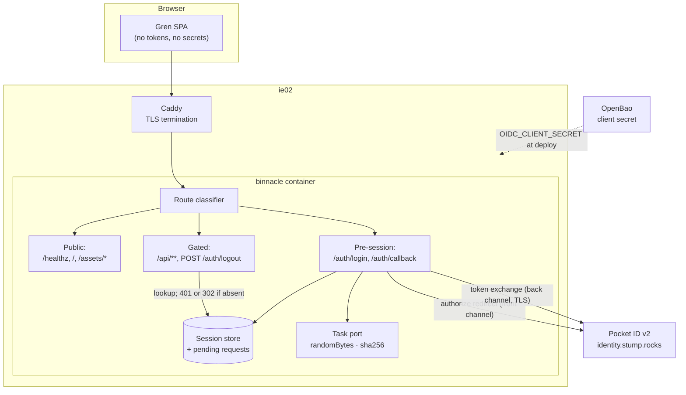
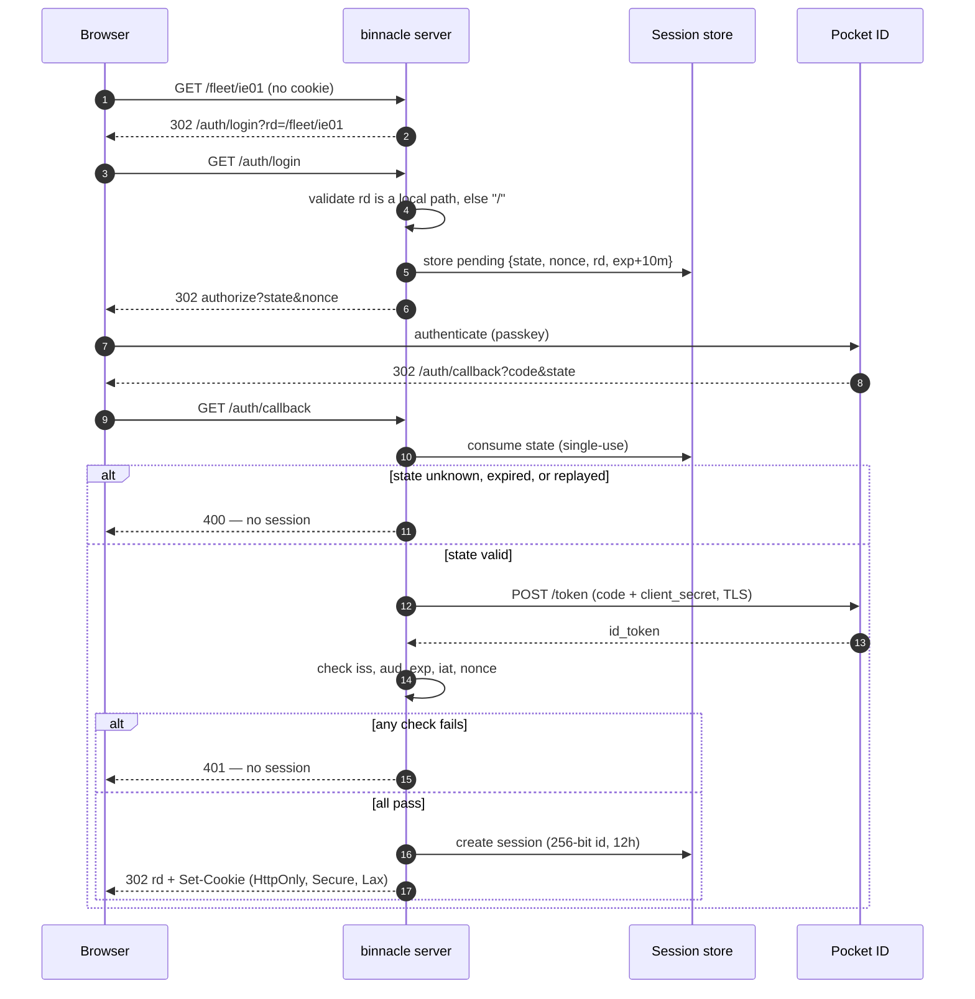

# Design: OIDC Authentication — Pocket ID Login and Server-Side Sessions

## Context

binnacle is deployed at `https://binnacle.stump.rocks` on ie02 and is presently unauthenticated: the container runs a dependency-free `node:http` static file server that serves the Gren SPA to anyone who resolves the name. ADR-0004 decided that binnacle authenticates as a **native OIDC confidential client** against Pocket ID v2, rather than delegating to the shared oauth2-proxy, because binnacle needs the identity as data it can attribute control actions to — not merely as a gate it passed.

Two constraints shape everything below:

1. **There is no server yet.** ADR-0001 places the Gren server (`gren-lang/node`) and `packages/core` in the bootstrap story; today only `web/` exists. This spec describes what the server does when it lands, and names the interim mitigation for the window before it does.
2. **Gren has no cryptography.** `gren-lang/node` 6.1.3 exposes `Node`, `Init`, `Terminal`, `ChildProcess`, `FileSystem`, `HttpClient`, `HttpServer` — no hashing, no HMAC, no JWT, no CSPRNG — and the registry offers no third-party equivalent. Every design decision here is downstream of that.

Realizes SPEC-0003. Governed by ADR-0004, which extends ADR-0001. Fleet precedent is `stumpcloud/ansible` ADR-0018.

## Goals / Non-Goals

### Goals

- Every route but the health probe, the static bundle, and the two pre-session endpoints requires an authenticated session.
- Login is the fleet's single passkey ritual against Pocket ID; binnacle never sees a password.
- No token, refresh token, or client secret is reachable from browser JavaScript.
- The authenticated identity is a typed value in `packages/core`, shared by server and SPA.
- The design is implementable on Gren's actual surface, not an idealized one.
- The current open door is closed now, not when the server ships.

### Non-Goals

- **Per-user authorization.** Any authenticated Pocket ID user is a full binnacle user. Roles scoped over the ADR-0002 taxonomy want their own ADR once control actions define what needs restricting.
- **Calling provider APIs on the user's behalf.** binnacle needs identity, not delegated access, so no access or refresh token is persisted.
- **Cross-service SSO cookies.** The session cookie is host-scoped deliberately; oauth2-proxy's domain-wide `.stump.rocks` cookie is what binnacle is moving away from.
- **Local accounts, password login, invitations, or account recovery.** Pocket ID owns identity entirely.
- **A general-purpose JavaScript FFI layer.** The task port is two functions wide and stays that way.

## Decisions

### Confidential client, authorization code flow, server-side session

**Choice**: The Gren server is a confidential OIDC client. It exchanges the code server-to-server and hands the browser only an opaque session cookie.

**Rationale**: It is the only shape where the browser holds no credential. It also matches every other native-OIDC service on the fleet, so operational knowledge transfers.

**Alternatives considered**:
- *Public client with PKCE in the SPA*: puts tokens in browser-reachable storage — precisely the exposure this avoids — and needs SHA-256 in the browser, where Gren is equally crypto-less.
- *Implicit or hybrid flow*: delivers tokens through the browser, which would make signature verification mandatory (see below) and is discouraged by current OAuth guidance regardless.

### Skip ID token signature verification, per OIDC Core §3.1.3.7

**Choice**: The server does not verify the ID token's RS256 signature. It validates `iss`, `aud`, `exp`, `iat`, and `nonce`, and relies on TLS server validation of the token endpoint for integrity.

**Rationale**: This is the decision that makes a Gren implementation possible at all. Verifying RS256 requires JWKS retrieval, key parsing, and RSA verification — none of which exists in Gren, and all of which would otherwise have to be hand-rolled or pushed through the port. OIDC Core §3.1.3.7 item 6 explicitly permits a client that receives the ID token *by direct communication with the token endpoint* to substitute TLS validation for the signature check. This flow is exactly that case.

The exemption is narrow and its boundary is load-bearing: it holds only because the token never touches the browser. That is a second, independent reason the implicit and hybrid flows are excluded, and it is why TLS verification must never be disabled — the chain to `identity.stump.rocks` is the sole integrity guarantee.

**Alternatives considered**:
- *Hand-roll RS256 + JWKS in Gren*: a large amount of security-critical bit-twiddling in a language with no crypto test vectors in-ecosystem. The failure mode of a subtle bug is silent acceptance of forged tokens.
- *Push JWT verification through the task port*: widens the port from two narrow primitives to "verify this token", which relocates the security decision into untyped JavaScript and defeats the point of keeping the port auditable.

### Crypto via a two-function task port

**Choice**: A task port exposes exactly `randomBytes` and `sha256`, backed by Node's `crypto`.

**Rationale**: `state`, `nonce`, and session identifiers all require a CSPRNG. Gren has none, and `gren-lang/core`'s `Random` is a seeded PRNG — predictable, and catastrophic if used for a session identifier. Gren's 25S release added task ports specifically to make this interop clean. Keeping the surface at two functions preserves most of the auditability ADR-0001 claims for Gren's capability model.

`sha256` is included even though the confidential-client flow does not require PKCE, so that adding PKCE later — or hashing a session identifier at rest — does not mean reopening the port.

**Alternatives considered**:
- *Read `/dev/urandom` via `FileSystem`*: works for randomness with no port at all, and was tempting. Rejected as the primary mechanism because it silently ties the server to Linux and gives nothing for SHA-256, so the port would be needed anyway. It remains a reasonable fallback if ports prove awkward.
- *Shell out to `openssl` via `ChildProcess`*: spawns a process per login, and moves a security primitive into argv where it is visible in the process table.

### Opaque session identifier, not a signed cookie

**Choice**: A 256-bit random identifier in the cookie; all state server-side.

**Rationale**: A signed or encrypted cookie would need HMAC or AEAD — crypto Gren does not have, which would widen the port. An opaque identifier needs only randomness. It also makes logout genuinely effective: deleting the server-side record invalidates a copied cookie, which a self-contained signed cookie cannot do before its expiry.

**Trade-off accepted**: every authenticated request costs a session lookup. At binnacle's scale — a household fleet console with a handful of users — that is not a consideration.

### Host-scoped cookie, not domain-wide

**Choice**: No `Domain` attribute, so the cookie is scoped to `binnacle.stump.rocks` alone.

**Rationale**: oauth2-proxy's domain-wide `.stump.rocks` cookie is what gives the fleet SSO, and it is also what makes any one service's cookie handling everyone's problem. binnacle owns its own session; the shared login ritual at Pocket ID already supplies the "log in once" experience in practice, since the passkey prompt is skipped when the IdP session is live.

### Interim gate via oauth2-proxy

**Choice**: Set `oauth2_proxy.enabled: true` on binnacle's dub.yaml entry now; remove it in the same change that turns on native login.

**Rationale**: The exposure is live today and the server is not close. A one-line inventory change closes it immediately at zero engineering cost. ADR-0004 chose native OIDC as the *architecture*; this is a deployment stopgap, not a competing design.

The two must never be simultaneously active. Forward auth in front of binnacle's own redirect produces a loop — Caddy redirects to `auth.stump.rocks`, which returns to binnacle, which redirects to `/auth/login`, which redirects to Pocket ID — that is confusing to diagnose from either end. Because the removal and the enablement are one change, this is a sequencing rule, not a runtime concern.

## Architecture

The server sits between Caddy and the SPA bundle, owning three route classes: public, authenticated, and the two pre-session auth endpoints.

The login sequence, and the points at which a request is refused:

## Risks / Trade-offs

- **TLS to the IdP is the only integrity guarantee for the ID token.** → Certificate verification must never be disabled by config, env, or build flag; the spec states this normatively. Revisit immediately if any token ever arrives by a path other than the direct token endpoint.
- **The task port is a hole in Gren's managed-effects guarantee.** → Two functions, no general evaluation entry point, and reviewed as security-critical code.
- **binnacle stays open until the server ships.** → The oauth2-proxy interim gate closes it now; the ADR records this as the accepted cost of choosing native OIDC.
- **Login loop if both gates are active.** → Enablement and removal are the same change. Called out in the spec so a future reader does not "helpfully" re-add forward auth.
- **`/healthz` must stay public or the container deadlocks against its own HEALTHCHECK.** → Enumerated as public with that justification, and covered by a scenario.
- **Sessions are lost on container restart if held in memory.** → Acceptable at this scale: the cost is a passkey tap, and the IdP session usually makes it invisible. If it becomes annoying, SQLite via `gren-lang/node` is the escape hatch, which is why the spec states store requirements conditionally rather than mandating memory.
- **12-hour sessions on a fleet console are a judgement call.** → Long enough to avoid re-login during a working day, short enough that a forgotten browser is not indefinite. Cheap to shorten later; changing it breaks nothing.

## Migration Plan

1. **Close the door now.** Set `oauth2_proxy.enabled: true` on binnacle's dub.yaml entry in `stumpcloud/ansible` and converge. binnacle is gated within one deploy, before any binnacle code changes.
2. **Provision the client.** Add a `joestump.pocket_id.oidc_client` task registering `binnacle` with `redirect_uri = https://binnacle.stump.rocks/auth/callback`; the secret lands in OpenBao and reaches the container as `OIDC_CLIENT_SECRET`.
3. **Land the server.** The Gren server arrives with the bootstrap story per ADR-0001; the CMD switches from `server.js` to the compiled binary, as the Dockerfile already anticipates.
4. **Implement in dependency order**: task port → session store → route classifier → `/auth/login` → `/auth/callback` → `/api/session` → logout → security headers and rate limiting.
5. **Cut over in one change.** The commit that enables native login removes `oauth2_proxy.enabled` from the inventory. Verify against the spec's scenarios before and after.

**Rollback**: re-set `oauth2_proxy.enabled: true` and pin the image to the prior `sha-<short>` tag. The forward-auth gate is independent of binnacle's own code, so it is always available as a fallback.

## Open Questions

- **Session store medium.** In-memory is simplest and loses sessions on restart; SQLite via `gren-lang/node` survives restarts and adds a file to back up. Deferred to implementation, when the restart cadence is known.
- **Does Pocket ID v2 support back-channel logout?** If so, an RP-initiated logout endpoint would let a Pocket ID sign-out propagate into binnacle rather than leaving a session valid until expiry. Not in scope here; worth a follow-up.
- **Is 12 hours right?** Chosen as a working-day default with no data behind it. Revisit once there is real usage.
- **Where do control actions get audited?** ADR-0004 defers this. The session gives binnacle the identity to attribute an action to, but not the decision of whether binnacle keeps its own audit log or writes to an existing one.
- **Does an authenticated non-admin exist?** Currently no — every Pocket ID user is a full user. The moment that stops being acceptable, it is an ADR, not a spec amendment.
