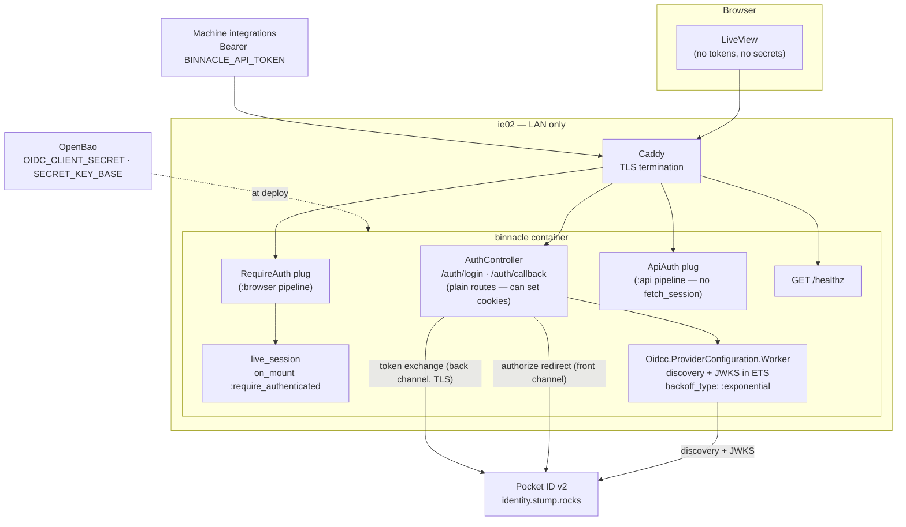
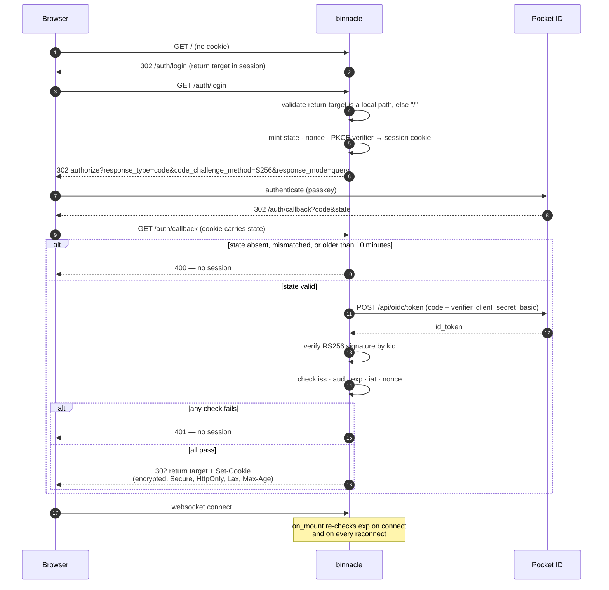

# Design: OIDC Authentication — Pocket ID Login and Phoenix Sessions

## Context

binnacle is deployed at `https://binnacle.stump.rocks` on ie02 and is presently unauthenticated. The name is a CNAME to `ie02.stump.rocks` → `192.168.100.213`, an RFC1918 address, so the console is **unauthenticated and LAN-only** rather than exposed to the internet; the DNS record is the entire boundary. ADR-0006 decided that binnacle authenticates as a **native OIDC confidential client** against Pocket ID v2 rather than delegating to the shared oauth2-proxy, because binnacle wants the identity as data it can attribute control actions to — not merely as a gate it passed.

Two constraints shape everything below, and both are the opposite of the two that shaped this document's Gren-era draft:

1. **The server exists.** `server/` is a running Phoenix 1.8 application with LiveView screens over `Binnacle.Fleet`. There is no bootstrap to wait for and no interim gate to arrange.
2. **Elixir has cryptography.** `:crypto` is in OTP, `plug_crypto` is already in `mix.lock`, and JOSE is one dependency away. Nothing here is shaped by an absence of primitives.

A third fact is worth stating plainly because it tempers the urgency without changing the decision: **binnacle has no control actions yet.** `server/lib/binnacle_web/router.ex` defines two LiveView routes, four `GET` API routes, `GET /healthz`, and a catch-all that answers `405`. There is not one mutating route in the application. The per-user attribution driver is anticipatory — the reason to build the identity-bearing shape now rather than retrofit it later — not a problem binnacle has today.

Realizes SPEC-0003. Governed by ADR-0006, which extends ADR-0004. Fleet precedent is `stumpcloud/ansible` ADR-0018.

## Goals / Non-Goals

### Goals

- Every route but the health probe, static assets, and the two pre-session endpoints requires an authenticated session — enforced on the socket as well as on the request.
- Login is the fleet's single passkey ritual against Pocket ID; binnacle never sees a password.
- ID tokens are signature-verified, with key rotation handled by a library rather than by binnacle.
- No token, refresh token, or client secret is reachable from browser JavaScript, rendered HEEx, or socket assigns.
- The authenticated identity is one Elixir struct, used identically by the plug and the `on_mount` hook.
- The two authentication schemes already in the application — browser session and machine bearer token — are separated deliberately rather than left overlapping.

### Non-Goals

- **Per-user authorization.** Any authenticated Pocket ID user is a full binnacle user. Roles over the ADR-0002 taxonomy want their own ADR once control actions define what needs restricting. `groups` is captured so that ADR has something to build on.
- **Calling provider APIs on the user's behalf.** binnacle needs identity, not delegated access, so no access or refresh token is persisted and `offline_access` is not requested.
- **Cross-service SSO cookies.** The session cookie is host-scoped deliberately; oauth2-proxy's domain-wide `.stump.rocks` cookie is what binnacle is moving away from.
- **Immediate session revocation.** Deliberately traded away, with the loss recorded below and in the spec.
- **Local accounts, password login, invitations, or account recovery.** Pocket ID owns identity entirely.

## Decisions

### Confidential client, authorization code flow with PKCE

**Choice**: The Phoenix server is a confidential OIDC client. It exchanges the code server-to-server with `client_secret_basic` and hands the browser only a session cookie. PKCE with `S256` is used even though a confidential client does not strictly require it.

**Rationale**: It is the only shape where the browser holds no credential. PKCE costs nothing and closes code injection independently of the secret. Three parameters are pinned because Pocket ID advertises a weaker alternative for each: `response_type=code` (it also offers `id_token`), `code_challenge_method=S256` (it also offers `plain`), and `client_secret_basic` (it also offers `none`).

**Alternatives considered**:
- *Public client with PKCE in the browser*: puts tokens in browser-reachable storage, and fits LiveView badly — the natural home for the identity is the socket's assigns, not `localStorage`.
- *Implicit or hybrid flow*: delivers tokens through the browser and is discouraged by current OAuth guidance regardless.

### `response_mode=query`, not `form_post`

**Choice**: The authorization response returns as a redirect with query parameters.

**Rationale**: This looks like a style choice and is not. `form_post` returns the response as a **cross-site POST** from `identity.stump.rocks` to binnacle. `SameSite=Lax` means the session cookie — the one carrying `state`, `nonce`, and the PKCE verifier — is **not sent** on that request, so the callback has nothing to correlate against. And `protect_from_forgery` on the `:browser` pipeline would reject the POST as forgery before that even mattered. Choosing `form_post` produces a login that fails in a way that reads like a cookie bug.

### `oidcc` + `oidcc_plug`, not a hand-rolled flow

**Choice**: `oidcc` 3.8.0 with `oidcc_plug ~> 0.5.1`.

**Rationale**: It is the only OpenID-Certified relying party in the ecosystem, and the only one that handles JWKS key rotation correctly — `Oidcc.ProviderConfiguration.Worker` caches discovery and JWKS in ETS and installs `refresh_jwks_for_unknown_kid` by default. Pocket ID publishes one RS256 key today; the day it rotates is the day this choice pays for itself. The dependency delta is `jose` and `telemetry_registry`; `plug`, `plug_crypto`, and `telemetry` are already in `mix.lock`, and `req` stays for the fleet pollers.

The worker is a child of `Binnacle.Supervisor` with **`backoff_type: :exponential`**. The default is `:stop`, which gives up permanently if Pocket ID is unreachable at boot — the wrong failure mode for a fleet monitor whose job is being up while other things are down. `oidcc_plug` is pinned to `~> 0.5.1` because 0.5.0 is retired on hex.

**Alternatives considered**:
- *`assent` 0.3.1*: correct validation and zero dependencies, but no caching at all, PKCE off by default, no RP-initiated logout, and a refresh path defaulting to a hardcoded `/oauth/token` that points at nothing against Pocket ID (whose token endpoint is `/api/oidc/token`).
- *`openid_connect` (DockYard)*: rejected. Popular, but validates neither `iss`, `nonce`, `azp`, nor `iat`, and does no `kid` matching — it tries every key and accepts if any verifies.
- *Hand-rolling the flow*: there is no argument for it now that a certified library exists.

### Verify the ID token signature

**Choice**: RS256 pinned to Pocket ID's advertised algorithm; `alg: none` and HMAC algorithms rejected before key lookup; key selected by `kid`; JWKS cached and re-fetched on unknown `kid` with the re-fetch rate-limited.

**Rationale**: The Gren draft invoked OIDC Core §3.1.3.7 item 6 to skip signature verification. The clause is real, but the reason it was invoked was that Gren had no cryptography — it was a workaround with a citation attached. Keeping it here would make the TLS chain to `identity.stump.rocks` the token's sole integrity guarantee forever, in exchange for skipping a check the chosen library performs by default.

Rejecting HMAC *before* key lookup rather than after is the specific defence against algorithm confusion, where an RSA public key is offered as an HMAC secret. Matching on `kid` rather than trying every key is the specific defence against the `openid_connect` defect above.

### Sessions are Phoenix cookies; revocation is the price

**Choice**: `Plug.Session` with `store: :cookie`, signed **and encrypted**, `secure: true`, `http_only: true`, `same_site: "Lax"`, a `max_age` matching a 1-hour cap, no `:domain`, and both salts from config. No session store, no ETS table, no purge.

**Rationale**: The Gren draft's opaque server-side identifier existed because Gren could not sign or encrypt a cookie. Its revocation property was a consequence of that constraint, not its purpose. With Phoenix's own session mechanism available, building a bespoke store means owning supervision, expiry sweeps, and novel security-critical code for a household fleet console with a handful of users.

**What that loses, stated rather than smuggled**: a cookie session cannot be revoked before it expires. Logout clears the cookie in that browser; a value captured beforehand and replayed still authenticates until `exp`. Three things bound the exposure:

1. An `exp` claim **inside** the payload, checked on every request and every mount including reconnects — the client's `Max-Age` is not trusted to enforce expiry.
2. `live_socket_id` plus `Endpoint.broadcast/3` on logout, which terminates connected LiveViews immediately. This is a disconnect, not a revocation, and is described that way deliberately.
3. The 1-hour cap itself.

**Revisit trigger**: a shared workstation, a lost device, or a per-user authorization model where demotion must take effect at once. Any of those makes a server-side store the right answer, and none of them is true today.

### Authentication is enforced twice

**Choice**: `BinnacleWeb.Plugs.RequireAuth` in the router pipeline, **and** `on_mount {BinnacleWeb.Auth, :require_authenticated}` attached to a `live_session`.

**Rationale**: `pipe_through :browser` runs for the dead HTTP render and never again. When the socket connects — and on every reconnect after a deploy, a network blip, or a laptop waking up — LiveView re-runs `mount/3` with only what was captured in `connect_info[:session]`, and no plug participates. A plug alone therefore leaves every LiveView reachable over the socket by anyone holding a cookie the plug would have rejected.

`live_session` is load-bearing, not ceremony: it is what exposes the session to `on_mount`, and what forces a **full page reload** rather than a live navigation when crossing an auth boundary, so an expired session cannot be live-patched around.

**Testing consequence**: a test that only exercises `get(conn, "/")` does not cover this design. The socket path needs its own `LiveViewTest` connecting with an invalidated session.

### The auth endpoints are controller routes, outside every `live_session`

**Choice**: `GET /auth/login` and `GET /auth/callback` are actions on `BinnacleWeb.AuthController`, on a dedicated `:auth` pipeline.

**Rationale**: mechanical — **a LiveView process cannot set a cookie**. By the time a LiveView mounts over the websocket the HTTP response is long sent and there is no `Plug.Conn`. Since `state`, `nonce`, and the PKCE verifier live in the session cookie, the endpoint that mints them must be a controller action, and so must the callback that writes the authenticated session.

### Identity from the ID token alone

**Choice**: One struct, `Binnacle.Auth.Identity`, populated from the validated ID token. No userinfo request.

**Rationale**: Pocket ID puts `groups` in the ID token when the scope is requested, so `sub`, `email`, `name`, `preferred_username`, `picture`, and `groups` all arrive signature-verified in one hop. A userinfo call would add a round-trip, a second failure mode, and a second thing to cache, for claims already in hand.

The struct's fields are bounded by the provider's `claims_supported` so it cannot drift into inventing fields Pocket ID never sends, and it carries no token or credential — socket assigns are serialized into LiveView process state and are one `inspect/1` from a log line.

### Two authentication schemes, kept apart on purpose

**Choice**: browser session for HTML and LiveView; `ApiAuth`'s static bearer token for `/api/**`; neither grants the other; the `:api` pipeline never calls `fetch_session`.

**Rationale**: `/api/**` serves machine integrations. A bearer token is the right credential for a script and the wrong one for a person — it carries no identity and can attribute nothing. Conversely, letting a browser session authenticate `/api/**` would make any page the user visits a potential deputy against the API.

The enforcement is structural rather than conventional: a pipeline that never reads the session cannot honour one by accident. The shipped `:api` pipeline is already `[:accepts, RateLimit, ApiAuth]`, so this ratifies the code — **the spec is what changed**, since its access-boundary table claimed `/api/**` required a session.

### RP-initiated logout only

**Choice**: `POST /auth/logout` clears the session, broadcasts the socket disconnect, and redirects to `end_session_endpoint` with `id_token_hint`. The ID token is retained in the session solely to supply that hint.

**Rationale**: Pocket ID's discovery document advertises neither `frontchannel_logout_supported` nor `backchannel_logout_supported`, so the IdP cannot push a logout into binnacle. Redirecting to the end-session endpoint at least signs the user out at the provider, rather than leaving them silently re-admitted on the next login attempt. It also means an account disabled at the IdP keeps working in binnacle until the session expires — which is the concrete reason the cap is one hour rather than a working-day default.

## Architecture

The login sequence, and the points at which a request is refused:

## Risks / Trade-offs

- **Logout is not revocation.** → Bounded by a 1-hour cap, an `exp` claim checked server-side on every request and mount, and a socket disconnect broadcast on logout. Revisit if the threat model gains a shared or lost device.
- **The IdP cannot push a logout.** → Pocket ID supports neither front- nor back-channel logout. Same bound: session lifetime. RP-initiated logout at least ends the IdP session.
- **Auth is enforced in two places that must agree.** → The `on_mount` hook and the plug consume the same session and build the same identity struct; a `LiveViewTest` against an invalidated session is a required test, not an optional one.
- **Boot-time dependency on Pocket ID.** → `backoff_type: :exponential` keeps the container up and retrying instead of refusing to start. Logins degrade; the fleet view does not disappear.
- **`SECRET_KEY_BASE` is regenerated on every boot today.** → With a cookie store that invalidates every session on every redeploy. Must become an OpenBao secret before this ships; it is a spec requirement rather than a deployment footnote for exactly that reason.
- **`PHX_HOST` is unset**, so absolute URLs generate as `example.com`. → Latent while LiveView uses relative URLs; a hard failure the moment `redirect_uri` must be absolute.
- **The Dockerfile HEALTHCHECK probes `/`**, which gets gated. → Move it to `/healthz` no later than the change that gates `/`, or the container is permanently unhealthy.
- **`plain` PKCE and `id_token` responses are on the provider's menu.** → Pinned explicitly in code, not left to library defaults, and asserted in tests.
- **Session length is the only security lever in this design.** → With no revocation, the cap is simultaneously the window a stolen cookie works, the window a logged-out cookie works, and the window a disabled account still reaches binnacle. Set to **1 hour** deliberately, accepting more re-logins in exchange for not building a session store. Lengthening it is a security decision, not a UX tweak.

## Migration Plan

There is no interim gate. The Gren-era plan opened by enabling `oauth2_proxy.enabled: true` because `server/` did not exist; issue #18 closed that as won't-do in favour of going native, on the bet that this work lands before binnacle's exposure changes. If that bet goes wrong — the LAN-only DNS record changes — reopening #18 is a handful of inventory lines and remains the fallback.

1. **Provision the client.** A `joestump.pocket_id.oidc_client` task registers `binnacle` with `redirect_uri = https://binnacle.stump.rocks/auth/callback` and **`pkce_enabled: true`**; the secret lands in OpenBao and reaches the container as `OIDC_CLIENT_SECRET`.
2. **Fix the deployment preconditions.** `SECRET_KEY_BASE` from OpenBao with the random fallback removed; `PHX_HOST` set on binnacle's `dub.yaml` entry (which has no `environment:` block today at all).
3. **Land the flow** (#20): dependencies, the supervised provider-configuration worker, `runtime.exs` config, `AuthController`, token exchange, ID-token validation.
4. **Land the boundary** (#21): `Plug.Session` hardening, `RequireAuth`, `live_session` + `on_mount`, the identity struct, the authenticated shell and sign-out control, and the Dockerfile HEALTHCHECK move to `/healthz` **in the same change** that gates `/`.
5. **Land the hardening** (#22): auth-endpoint rate limiting with its own budget, return-target validation, structured error tuples, and the header reconciliation.
6. **Verify against the running container**, not only in unit tests — the CSP and the HEALTHCHECK cannot be verified any other way.

**Rollback**: pin the image to the prior `sha-<short>` tag. If the exposure boundary has also changed by then, `oauth2_proxy.enabled: true` gates binnacle independently of its own code and is always available.

## Open Questions

- **Is 1 hour right?** Chosen deliberately as the trade for having no revocation — it is the *only* bound on a replayed cookie, on a logged-out cookie, and on a disabled account. If it proves annoying in practice, the answer is a session store (which makes length a convenience question again), not a longer cap.
- **Does the revocation gap need closing before control actions ship?** A read-only console with a 1-hour session is a different risk from a console that can restart containers. The honest answer is that it should be re-asked when the first mutating route is written, not now.
- **Where do control actions get audited?** ADR-0006 defers this. The session supplies the identity to attribute an action to; it does not decide whether binnacle keeps its own audit log or writes to an existing one.
- **Does `groups` become authorization, and when?** Captured today, unused today. The moment "every authenticated Pocket ID user is a full binnacle user" stops being acceptable, it is an ADR, not a spec amendment.
- **Do the fleet pollers ever need per-user API access?** Today `/api/**` is one machine token. Per-user API access would be a new decision — token exchange, or per-user tokens — not a loosening of the no-crossover rule.
